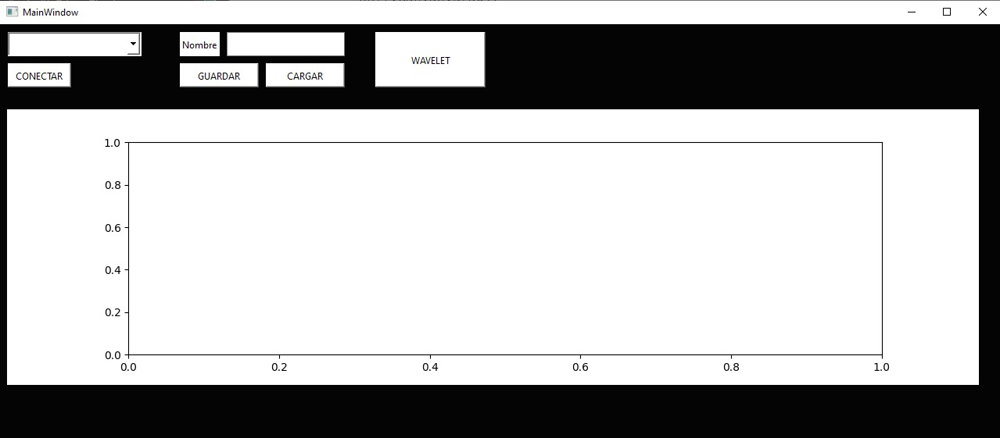
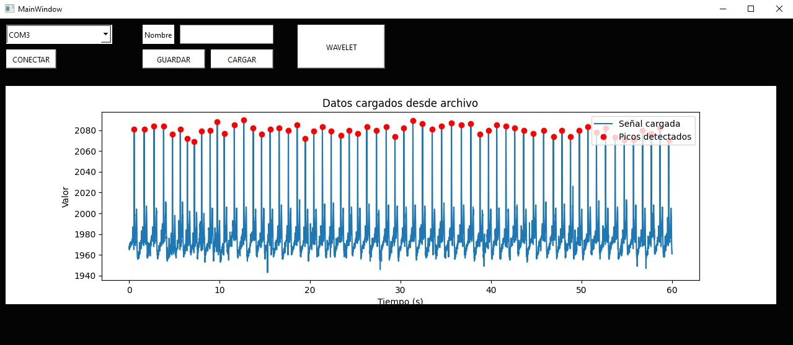
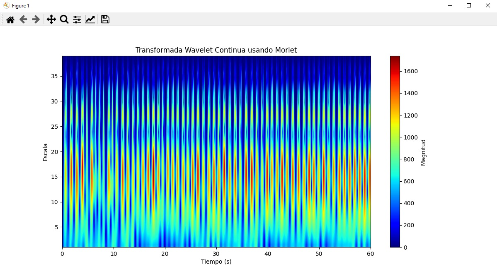
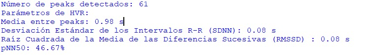
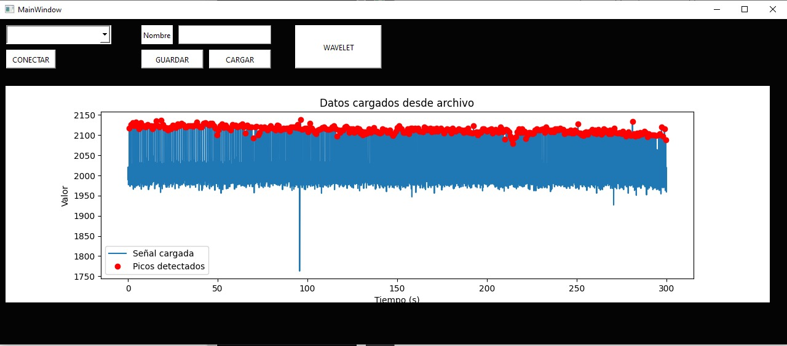
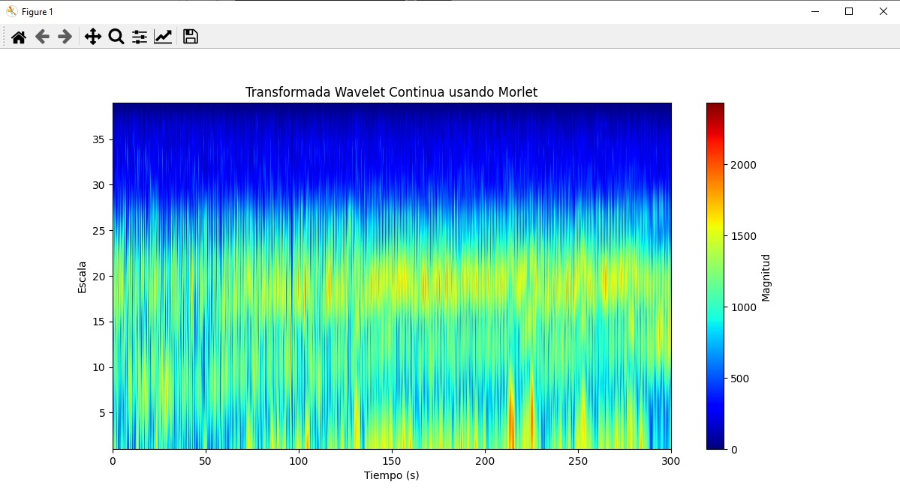
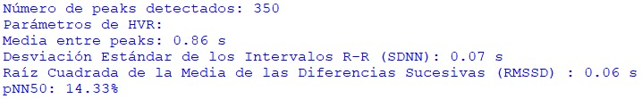
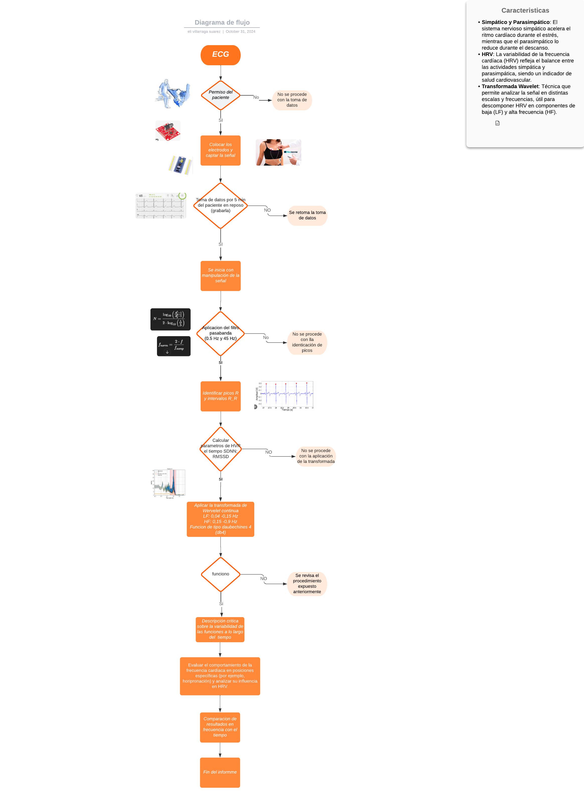
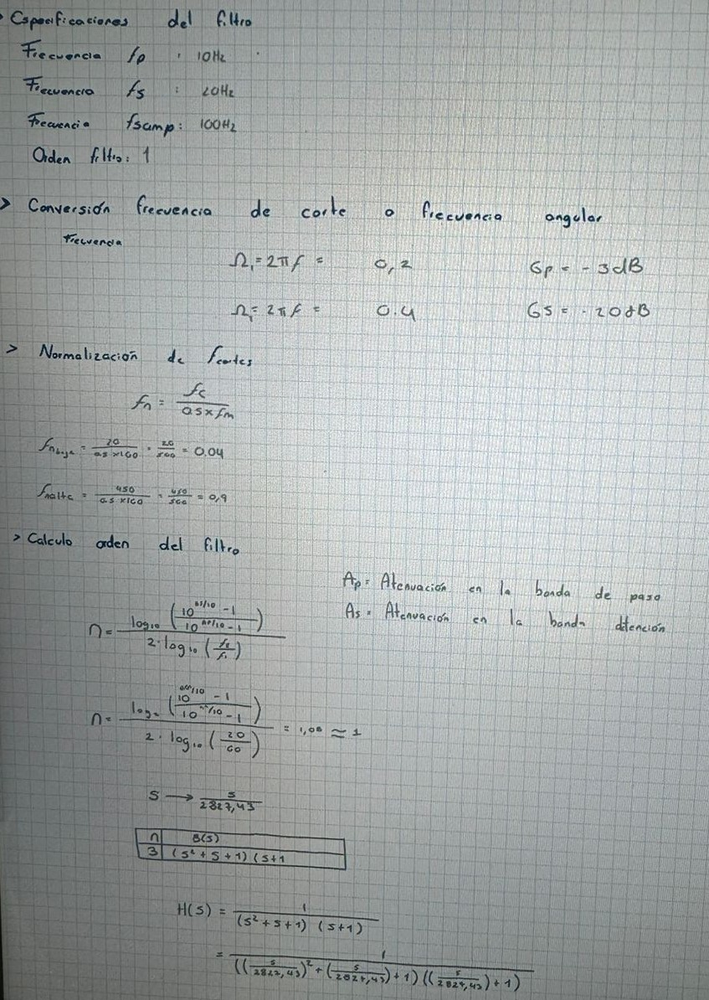

# Procesamiento de una señal de ECG
## Disclaimer
Los datos de las muestras utilizados en este proyecto son de mi propiedad y han sido generados a partir de mis propias mediciones. Se permite el uso y la distribución de estos datos con fines de investigación, educación y desarrollo de proyectos relacionados con el procesamiento de señales electromiográficas. Sin embargo, se solicita que se reconozca la fuente de los datos y se respete la integridad de la información. Cualquier uso comercial de estos datos requerirá mi consentimiento previo.
## Introducción
El laboratorio consistió en la elaboración de un código para el análisis de señales electrocardiograficas (ECG). Este código cuenta con varias secciones que aplican técnicas avanzadas como el uso de ventanas de filtros discretos con ventanas de Hanning,análisis espectral mediante la transformada wavelet con la función Morlet  y el funcionamiento de interfaces que operan en tiempo real. Estas herramientas permiten procesar y analizar las señales capturadas durante 5.Este proyecto tiene el potencial de ser útil en diversas aplicaciones biomédicas, como la rehabilitación.
### Adquisición de datos
Se utilizó un microcontrolador STM32 para adquirir los datos mediante un módulo ECG AD8232. El código implementado captura los datos y los empaqueta en bloques de 50 bytes (50B). Este programa opera utilizando un sistema operativo en tiempo real (RTOS) para la gestión eficiente de tareas en la STM32, lo que ayuda a evitar la congestión en la transmisión de datos. La configuración del sistema está diseñada para trabajar con una frecuencia de muestreo de 100Hz, garantizando un procesamiento continuo y en tiempo real de las señales electromiográficas.

La primera sección del código está diseñada para gestionar los parámetros de la interfaz gráfica, la cual permite visualizar y analizar datos en tiempo real. A través de la conexión con el puerto serial, se reciben datos provenientes del microcontrolador STM32. La interfaz muestra las señales filtradas que el microcontrolador envía, garantizando una representación clara de la información. Además, incluye botones para guardar y cargar las señales capturadas, así como para aplicar el wavelet a los pulsos detectados, lo que optimiza tanto la visualización como el análisis de las señales. Esta funcionalidad es fundamental para la interpretación precisa de los datos y el estudio de las características de las señales capturadas.
```pyton
class principal(QMainWindow):

    def __init__(self):
        super(principal, self).__init__()
        uic.loadUi("ECGW.ui", self)
        self.puertos_disponibles()
        self.ser1 = None
        self.connect.clicked.connect(self.conectar)

        self.guardarButton.clicked.connect(self.guardar_datos)
        self.cargarButton.clicked.connect(self.cargar_y_mostrar_datos)
        self.espectrogramaButton.clicked.connect(self.calcular_espectrograma)


        self.fm = 100  # Frecuencia de muestreo (100 Hz)
        self.duracion = 300 # (segundos)

        # Crear eje X en tiempo (segundos)
        self.x = np.linspace(0, self.duracion, int(self.duracion * self.fm))
        self.y = np.zeros(int(self.duracion * self.fm))

        # Configurar el gráfico
        self.fig = Figure()
        self.ax = self.fig.add_subplot(111)
        self.canvas = FigureCanvas(self.fig)

        layout = QVBoxLayout()
        layout.addWidget(self.canvas)
        self.graficawidget.setLayout(layout)

        # Configuración del filtro FIR pasabanda con ventana Hanning
        self.fc_baja = 0.5  
        self.fc_alta = 45   

        # Normalizar las frecuencias de corte
        self.fn_baja = self.fc_baja / (0.5 * self.fm)
        self.fn_alta = self.fc_alta / (0.5 * self.fm)

        self.orden_fir = 1

        # Crear el filtro FIR con ventana Hanning
        self.b_fir = firwin(self.orden_fir, [self.fn_baja, self.fn_alta], pass_zero=False, window="hann")

        # Establecer umbral para la detección de peaks
        self.umbral = 2065

    def puertos_disponibles(self):
        p = serial.tools.list_ports.comports()
        for port in p:
            self.puertos.addItem(port.device)

    def conectar(self): 
        estado = self.connect.text()
        self.stop_event_ser1 = threading.Event()
        if estado == "CONECTAR":
            com = self.puertos.currentText()
            try:
                self.ser1 = serial.Serial(com, 115200)
                self.hilo_ser1 = threading.Thread(target=self.periodic_thread1)
                self.hilo_ser1.start()
                print("Puerto serial 1 Conectado")
                self.connect.setText("DESCONECTAR")

            except serial.SerialException as e:
                print("Error en el puerto serial 1: ", e)
        else:
            self.ser1.close()
            self.stop_event_ser1.set()
            self.hilo_ser1.join()
            print("Puerto serial 1 Desconectado")
            self.connect.setText("CONECTAR")

    def periodic_thread1(self):
        if self.ser1 is not None and self.ser1.is_open:
            data = self.ser1.read(50)
            if len(data) == 50:
                data = struct.unpack('50B', data)
                for i in range(0, len(data), 2):
                    self.y = np.roll(self.y, -1)
                    self.y[-1] = data[i] * 100 + data[i + 1]

                self.ax.clear()

                # Aplicar el filtro FIR con ventana Hanning a los datos en tiempo real
                df = lfilter(self.b_fir, 1.0, self.y)

                # Graficar la señal filtrada en función del tiempo
                self.ax.plot(self.x, df)
                self.ax.set_xlabel('Tiempo (s)')
                self.ax.set_ylabel('Amplitud')
                self.ax.set_title('Señal en Tiempo Real')
                self.ax.grid(True)
                self.canvas.draw()

        if not self.stop_event_ser1.is_set():
            threading.Timer(1e-3, self.periodic_thread1).start()
```
En esta sección del código, se implementa un filtro FIR (Finite Impulse Response) pasabanda diseñado específicamente para procesar señales de ECG (electrocardiograma) en tiempo real. El filtro se configura con frecuencias de corte de 0.5 Hz y 45 Hz, que son normalizadas en función de la frecuencia de muestreo de 100 Hz. Utilizando la función firwin de la biblioteca scipy.signal, se genera un filtro de orden 1 que permite el paso de frecuencias relevantes para la detección de características del ECG, mientras que atenúa las frecuencias no deseadas, como el ruido y las interferencias. Durante la adquisición de datos en tiempo real, el filtro se aplica a la señal capturada mediante la función lfilter, mejorando así la calidad de la señal del ECG y facilitando su análisis posterior.
### Carga y procesamiento 
La función cargar_y_mostrar_datos permite al usuario seleccionar un archivo de texto con datos de ECG. Crea un vector de tiempo x y detecta picos en la señal y usando un umbral específico, lo que es crucial para identificar los latidos del corazón. Además, se filtra la señal con un filtro FIR, lo que mejora la calidad de los datos al eliminar ruidos y artefactos.

Al cargar los datos, la interfaz, como primera condición, se encargará de encontrar los picos más altos en la señal de ECG y realizar un análisis estadístico de la variabilidad de la frecuencia cardíaca (HRV). Este análisis se centrará en calcular valores clave que permitan determinar las características generales del pulso cardíaco, como la media del tiempo entre picos (intervalos R-R) y la desviación estándar de estos intervalos. Estos parámetros son fundamentales para evaluar la salud cardiovascular, ya que la variabilidad en los intervalos R-R puede indicar el estado del sistema nervioso autónomo y la respuesta del cuerpo al estrés.
```pyton
    def cargar_datos(self, nombre_archivo):
        try:
            tiempo, amplitud = np.loadtxt(nombre_archivo, delimiter=',', unpack=True, skiprows=3)

            # Detectar peaks en la señal atenuada
            peaks, _ = find_peaks(amplitud, height=self.umbral)
            numero_peaks = len(peaks)
            print(f"Número de peaks detectados: {numero_peaks}")

            dpeaks = np.diff(peaks) / self.fm  
            self.HVR(dpeaks)

            return tiempo, amplitud

        except Exception as e:
            print("Error al cargar los datos:", e)
            return None, None
```
```pyton
    def cargar_y_mostrar_datos(self):
        nombre_archivo, _ = QFileDialog.getOpenFileName(self, "Seleccionar archivo", "", "Archivos de texto (*.txt)")
        if nombre_archivo:
            x, y = self.cargar_datos(nombre_archivo)
            if x is not None and y is not None:
                self.x = np.linspace(0, len(y) / self.fm, len(y))  
                self.y = y
                
                peaks, _ = find_peaks(self.y, height=self.umbral)
                
                self.ax.clear()
                self.ax.plot(self.x, self.y, label="Señal cargada")
                self.ax.plot(self.x[peaks], self.y[peaks], 'ro', label="Picos detectados")
                self.ax.set_xlabel('Tiempo (s)')
                self.ax.set_ylabel('Valor')
                self.ax.set_title('Datos cargados desde archivo')
                self.ax.legend()
                self.canvas.draw()

                self.y_filtrada = lfilter(self.b_fir, 1.0, self.y)

            else:
                print(f"No se pudieron cargar los datos desde {nombre_archivo}")
```
```pyton
    def HVR(self, dpeaks):
        print ("Parámetros de HVR:")
        if len(dpeaks) == 0:
            print("No hay suficientes datos de picos R-R para calcular los parámetros HRV.")
            return

        m_rr = np.mean(dpeaks)
        sdnn = np.std(dpeaks)
        rmssd = np.sqrt(np.mean(np.diff(dpeaks) ** 2))
        nn50 = np.sum(np.abs(np.diff(dpeaks)) > 0.05)
        pnn50 = (nn50 / len(dpeaks)) * 100

        print(f"Media entre peaks: {m_rr:.2f} s")
        print(f"Desviación Estándar de los Intervalos R-R (SDNN): {sdnn:.2f} s")
        print(f"Raíz Cuadrada de la Media de las Diferencias Sucesivas (RMSSD) : {rmssd:.2f} s")
        print(f"pNN50: {pnn50:.2f}%")
```
Por otro lado, una vez que se cargan los datos, se puede aplicar la transformada wavelet de Morlet para observar el espectro de frecuencias en función del tiempo, teniendo en cuenta la potencia de las señales. Es importante mencionar que se aplicó una atenuación a los datos antes de ser graficados, ya que nuestro objetivo es determinar los cambios en las pulsaciones y eliminar información no necesaria que podría interferir en el análisis. Además, se destaca que la visualización está restringida a una escala específica que muestra únicamente las frecuencias de hasta 40 Hz, las cuales son las más útiles y relevantes para este tipo de muestras de ECG.

El wavelet de Morlet es una herramienta matemática utilizada para analizar señales que cambian con el tiempo por esta razón es común mente usada para el tratamiento de señales biológicas como las de electrocardiograma (ECG). Su forma consiste en una onda oscilante con una envoltura que decae exponencialmente, lo que significa que tiene un pico en el centro que se debilita al alejarse. Esta característica le permite descomponer señales en diferentes frecuencias y tiempos, facilitando la observación de cómo las frecuencias están presentes en la señal a lo largo del tiempo. A diferencia de las transformadas de Fourier, que analizan la señal de manera global, el wavelet de Morlet permite un análisis local, siendo útil para detectar cambios y patrones importantes en la señal. En resumen, es una herramienta clave para comprender la estructura de las señales y las frecuencias que contienen.

```pyton
    def calcular_espectrograma(self):
        try:
            if not isinstance(self.y, np.ndarray):
                self.y = np.array(self.y)
            
            if self.y.size == 0:
                print("No hay datos suficientes para calcular el espectrograma.")
                return
            
            # Copiar y atenuar valores de amplitud para el espectrograma
            y_atenuada = np.array([0 if 0 <= x <= 2000 else x for x in self.y])
            
            scales = np.arange(1, 40)
            wavelet = 'cmor1.5-1.0'  
            coeficientes, freqs = pywt.cwt(y_atenuada, scales, wavelet, sampling_period=1/self.fm)

            plt.figure(figsize=(12, 6))
            plt.imshow(np.abs(coeficientes), extent=[self.x[0], self.x[-1], scales.min(), scales.max()],
                       cmap='jet', aspect='auto', interpolation='bilinear')
            plt.colorbar(label='Magnitud')
            plt.xlabel("Tiempo (s)")
            plt.ylabel("Escala")
            plt.title("Transformada Wavelet Continua usando Morlet")
            plt.show()

        except Exception as e:
            print("Error al calcular el espectrograma:", e)
```
### Resultados y análisis
Para poder determinar mejor las funciones del programa se hicioenron dos medicionesuna de 5 minutos y otra de un solo minuto 
#### 1 minuto

Al cargar los datos, el código identifica los valores que superan un umbral específico correspondiente a los segmentos R de la actividad eléctrica del corazón. Estos picos detectados se resaltan con un punto rojo en la gráfica, lo que permite visualizar claramente los momentos en los que se registra la actividad cardíaca significativa..


En esta gráfica de la Transformada Wavelet Continua usando la wavelet de Morlet para una señal de 1 minuto, se observan patrones periódicos claros, con picos de alta intensidad (en rojo) distribuidos a lo largo del tiempo y concentrados entre las escalas 5 y 20. Estos picos indican actividad regular, probablemente de los latidos cardíacos. La periodicidad marcada sugiere un ritmo estable, con variaciones de menor magnitud respecto a la muestra de 5 minutos, lo cual es consistente con un análisis a corto plazo.



En un análisis de la variabilidad de la frecuencia cardíaca (HRV) de una muestra de un minuto, se identificaron 61 picos. El intervalo promedio entre estos picos fue de 0.98 segundos, lo que corresponde a una frecuencia cardíaca aproximada de 61 latidos por minuto. La desviación estándar de los intervalos R-R (SDNN) fue de 0.08 segundos, indicando una variabilidad moderada en la frecuencia cardíaca. El RMSSD, con un valor de 0.08 segundos, sugiere una notable actividad parasimpática, reflejando un estado de relajación del sistema nervioso. Finalmente, el pNN50 fue del 46.67%, lo que indica una alta variabilidad en los intervalos y sugiere una buena capacidad del corazón de adaptación.
#### 5 minutos



La gráfica muestra la Transformada Wavelet Morlet para analizar una señal cardíaca de 5 minutos. Los colores indican la potencia de la señal en distintas escalas: tonos cálidos (amarillo y rojo) reflejan mayor intensidad. Se observa actividad constante entre las escalas 5 y 20, lo que sugiere un ritmo cardíaco estable con variaciones leves en potencia. El análisis se enfoca en frecuencias bajas, relevantes para estudiar la actividad cardíaca, excluyendo ruidos innecesarios.



En un análisis de variabilidad de la frecuencia cardíaca (HVR) de una muestra de 5 minutos, se detectaron 350 picos. La media entre los picos fue de 0.86 segundos, lo que indica una frecuencia cardíaca normal de aproximadamente 70 latidos por minuto. La desviación estándar de los intervalos R-R (SDNN) fue de 0.07 segundos, lo que sugiere una baja variabilidad, lo que podría reflejar una respuesta limitada del sistema nervioso autónomo.

El RMSSD, con un valor de 0.06 segundos, indica una actividad moderada del sistema parasimpático, sugiriendo un estado de relajación. Por último, el pNN50 fue del 14.33%, lo que muestra una cantidad moderada de variabilidad en los intervalos, indicando una buena adaptación del corazón a diferentes situaciones.

### Anexos
#### Diagrama de flujo

#### Calculos filtro

## Requisitos
- Pyton 3.9.0 ó superior
### Libreias:
- pywt
- datetime
- scipy
- struct
- PyQt6
- serial
- numpy
- datetime
- matplotlib
## Contacto 
est.julian.vergara@unimilitar.edu.co
est.elizabeth.vill@unimilitar.edu.co


